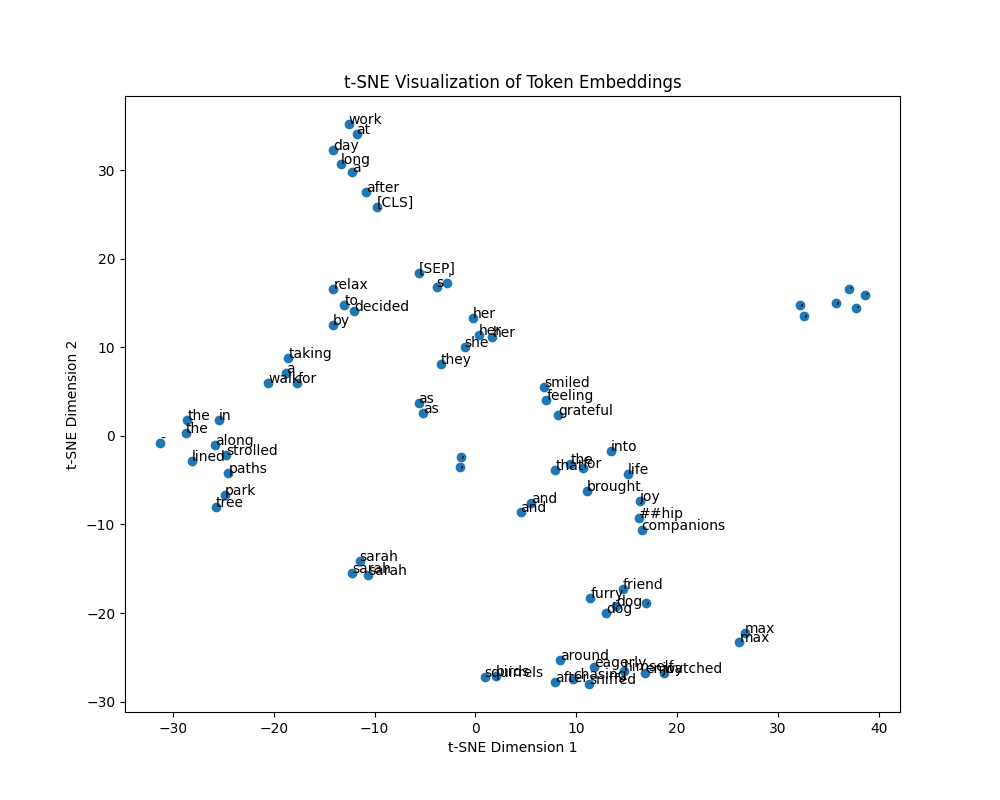

# Chapter 3. Using Hugging Face Transformers and Pipelines for NLP Tasks

## Approached notions

### Tokenization

In the context of NLP and machine learning, a "token" is a chunk of text that a model processes as a single unit. Tokens can represent an individual words, punctuation marks, or other linguistic elements, depending on the specific tokenization strategy employed. Tokenization is the process of converting a text document or sentence down into smaller units.

### Tensor

A **tensor** is a multi-dimensional array used in frameworks like PyTorch to efficiently handle numerical data, especially for GPU-accelerated computations.

### BERT

BERT stands for Bidirectional Encoder Representations from Transformers. It is a transformer-based machine learning model designed for natural language processing (NLP) tasks.

It is commonly used in natural language processing tasks such as question answering, text classification, named entity recognition, part-of-speech tagging, text summarization, sentiment analysis, language translation, text generation, coreference resolution, paraphrase detection, semantic search, textual entailment, and dialog systems.

### DistilBERT

It is a lighter, smaller, and faster version of BERT, suitable for deployment in resource-constrained environments.

### Token Embeddings

Token embeddings converts tokens into numerical vectors. These embeddings capture semantic and syntactic information about the tokens, enabling machine learning models to understand the underlying meaning and relationships between words in natural language text. In the context of NLP tasks, word embeddings allow you to see which words are often used together. It captures semantic
relationships between words based on their patterns in large text corpora. The embeddings are learned based on the co-occurrence and contextual relationships between words in the training corpus. As a result, words that have similar meanings or appear in similar contexts tend to have similar representations in the embedding space.

### t-SNE

It is a dimensionality reduction technique.

From ["Hands-on Machine Learning with Scikit-Learn, Keras & TensorFlow. O'Reilly. Third Edition"](https://www.amazon.ca/Hands-Machine-Learning-Scikit-Learn-TensorFlow/dp/1098125975/):

> _t-distributed stochastic neighbor embedding_... reduces dimensionality while trying to keep similar instances close and dissimilar instances apart. It is mostly used for visualization, in particular to visualize clusters of instances in high-dimensional space.

### Positional Encoding

Plays a crucial role in transformer-based models by providing positional information on the order of tokens within a sequence.
It is vital for model to grasp the meaning and context of the input accurately. By incorporating this encoding into the embeddings,
the model gains ability to discern between tokens based on their positions in the sequence. Positional encoding is typically
added to the token embeddings before they are input to the transformer model.

E.g.: The sentence "The cat sat on the sofa" has a different meaning than "The sofa set on the cat"

### Softmax

Softmax is a mathematical function that converts a vector of numbers into a probability distribution, where the probability
of each element is proportional to the exponentiation of that element's value relative to the sum of all the exponentiated values in the vector. In neural networks, Softmax is often used as the final activation function in classification tasks.

## Code examples

### Token Embeddings

In [this example](./token_embeddings.py) we are given code that extracts tokens from a sample short text, passes them to the BERT model, generates the embeddings and prints each word (decoded token) next to its embeddings:

```bash
uv run python chapter_03/token_embedddings.py
...
life: tensor([ 3.6462e-01, -5.7927e-02, -1.3655e-02, -1.0991e-01,  5.0892e-01,
        -7.5323e-03,  4.4139e-01,  7.5105e-01, -4.6468e-01,  4.3893e-01,
        -9.9271e-03, -8.2384e-01, -2.4836e-01,  9.2323e-01, -1.5780e-01,
         5.8997e-01,  4.1004e-01,  1.4265e-01, -2.5426e-01,  3.9373e-01,
...
```

We are using token embeddings to visualize the relationship between tokens. Since the embeddings have a high dimension cardinality, we are using `t-SNE` first to reduce dimensionality to 2 dimensions per token.  
We further use `matplotlib` to plot the tokens' graph:



### Sentiment Analysis

As in the previous example, in [this exercise](./sentiment_analysis.py) we kick off by tokenizing the input:

```bash
uv run python chapter_03/sentiment_analysis.py
tokenizer_config.json: 100%|...| 48.0/48.0 [00:00<00:00, 406kB/s]
config.json: 100%|...| 629/629 [00:00<00:00, 5.20MB/s]
vocab.txt: 232kB [00:00, 8.20MB/s]
model.safetensors: 100%|█...8M [00:03<00:00, 82.3MB/s]
{'input_ids': tensor([[  101,  1045,  3866,  1996,  3185,  1010,  2009,  2001, 10392,   999,
           102]]), 'attention_mask': tensor([[1, 1, 1, 1, 1, 1, 1, 1, 1, 1, 1]])}
```

What gets printed next is the model's output:

```bash
...
SequenceClassifierOutput(loss=None, logits=tensor([[-4.3428,  4.6955]], grad_fn=<AddmmBackward0>), hidden_states=None, attentions=None)
Predicted sentiment: positive
```

The `logit` key points to a value of shape (1, 2), where the first dimension corresponds to the batch size (number of texts), and the second dimension corresponds to the number of classes (2, 0 for "negative", and 1 for "positive"). Looking at the scores suggests that model correctly identified the text as highly likely to have positive tone. Hence, the predicted sentiment.

### Using Transformers Pipelines

The [first example](./transformers_pipelines.py) where pipelines are preferred to direct models' usage:

```bash
 uv run python chapter_03/transformers_pipelines.py
 "Unknown task dummy, available tasks are ['audio-classification', 'automatic-speech-recognition', 'depth-estimation', 'document-question-answering', 'feature-extraction', 'fill-mask', 'image-classification', 'image-feature-extraction', 'image-segmentation', 'image-text-to-text', 'image-to-image', 'image-to-text', 'mask-generation', 'ner', 'object-detection', 'question-answering', 'sentiment-analysis', 'summarization', 'table-question-answering', 'text-classification', 'text-generation', 'text-to-audio', 'text-to-speech', 'text2text-generation', 'token-classification', 'translation', 'video-classification', 'visual-question-answering', 'vqa', 'zero-shot-audio-classification', 'zero-shot-classification', 'zero-shot-image-classification', 'zero-shot-object-detection', 'translation_XX_to_YY']"
 Device set to use cuda
 [{'label': 'POSITIVE', 'score': 0.9998437166213989}, {'label': 'NEGATIVE', 'score': 0.9997773766517639}]
```

### NLP Tasks

```bash
uv run python chapter_03/npl_tasks.py
Question detection examples:
Device set to use cuda
[{'label': 'question', 'score': 0.9979926347732544}]
[{'label': 'non_question', 'score': 0.9997410178184509}]
Language detection example:
Device set to use cuda
[{'label': 'ja', 'score': 0.9913387298583984}]
Spam classification examples:
Device set to use cuda
[{'label': 1, 'score': 0.7025784254074097}]
[{'label': 0, 'score': 0.77765291929245}]
Text generation example:
Device set to use cuda
Setting `pad_token_id` to `eos_token_id`:50256 for open-end generation.
[{'generated_text': "In this course, we will teach you how to use the Google Play Services to track your activities and your data, and how to use Google Analytics to identify your data.\n\nIf you're new to Google Analytics, you might want to check out this course. It's a comprehensive introduction to analytics and how to use it to track your data. Check it out!\n\nIf you've never used Google Analytics before, you might want to check out this course. It's a comprehensive introduction to analytics and how to use it to track your data. Check it out!\n\nIf you're new to Google Analytics, you might want to check out this course. It's a comprehensive introduction to analytics and how to use it to track your data. Check it out!\n\nThis course is intended for students who want to learn how to use Google Analytics to track information in real time. You'll learn:\n\nHow to use Google Analytics to track event data, such as your location, activity, and location data\n\nHow to track activity data, such as your location, activity, and location data How to track location data, such as your location, activity, and location data How to track activity data, such as your location, activity, and location data How to track location data, such as your location,"}]
Truncation was not explicitly activated but `max_length` is provided a specific value, please use `truncation=True` to explicitly truncate examples to max length. Defaulting to 'longest_first' truncation strategy. If you encode pairs of sequences (GLUE-style) with the tokenizer you can select this strategy more precisely by providing a specific strategy to `truncation`.
Setting `pad_token_id` to `eos_token_id`:50256 for open-end generation.
Both `max_new_tokens` (=256) and `max_length`(=50) seem to have been set. `max_new_tokens` will take precedence. Please refer to the documentation for more information. (https://huggingface.co/docs/transformers/main/en/main_classes/text_generation)
[{'generated_text': 'In this course, we will teach you how to use the Google Chrome API to create and set up a WebSocket server. In this tutorial, we will walk you through how to create and setup a WebSocket server using Chrome WebSocket.\n\nThe Basics\n\nThe idea behind this tutorial is to give you a basic understanding of WebSocket.\n\nWhat is it?\n\nWebSocket is a protocol that allows you to send and receive data using any WebSocket protocol.\n\nIt is an open-source protocol which allows you to build and run a WebSocket server.\n\nWhat is it for?\n\nWebSocket is an open-source protocol which allows you to build and run a WebSocket server.\n\nHow does it work?\n\nWebSocket uses a new type of protocol called "WebSocket," in which messages are sent and received using either the same or different protocols.\n\nFor example, if you want to send a message across the Internet to a computer located in another country, you would use the WebSocket protocol.\n\nIf you want to send a message across the Internet to a person in another country, you would use the WebSocket protocol.\n\nWhat does it mean?\n\nWebSocket is an open source protocol, and using it to send and receive'}, {'generated_text': 'In this course, we will teach you how to create a custom class to use the following code:\n\nvar MyClass = new MyClass();\n\nWe will use the class constructor as we do so:\n\nclass MyClass { constructor(private val className, public val value) { val value = value; } }\n\nIn our class constructor, we create a new class named MyClass. The class name is the name of the class you want to use. The value is the name of the object you want to use. The class name is public and public is private.\n\npublic class MyClass { constructor(private val className, public val value) { val value = value; } }\n\nNow, we can use the class constructor to create a class named MyClass. The class name is public and public is private.\n\nclass MyClass { constructor(private val className, public val value) { val value = value; } }\n\nWe can then use code to create an object named MyClass. The class name is public and public is public.\n\nclass MyClass { constructor(private val className, public val value) { val value = value; } }\n\nNow, we can use code to create an object named MyClass.'}, {'generated_text': "In this course, we will teach you how to use the command line to create a custom, user-friendly user interface for your application. It can be any project, library or even a web app.\n\nThe most important things to get started with are:\n\nCreate a user interface\n\nCreate an account\n\nCreate an email address\n\nCreate a password\n\nCreate a web page\n\nNow you should be able to create a new user in the existing application using the command line.\n\nNext, we will create an email address to send you information about the application and how it works.\n\nThen, we will add a new user to the existing application.\n\nWe will use the command line to create a user interface.\n\nWe will create a user with a different name and type from the email address. We will also add an email address to the user's contacts and the current name to the contacts.\n\nWe can also add a password to the user's contacts.\n\nNow, you should be able to create a new user in the current application using the command line.\n\nNow, you should be able to create a new user with a different name and type from the email address. We will also add an email address to the user's contacts and the current"}]
Text summarization:
Device set to use cuda:0
Without sampling...:
[{'summary_text': 'A quantum computer is a computer that exploits quantum mechanical properties. Classical physics cannot explain the operation of these quantum devices. A large-scale quantum computer could break widely used encryption. The basic unit of information in quantum computing is the qubit, similar to the bit in traditional digital electronics. National governments have invested heavily in research that aims to develop scalable qubits with longer coherence times and lower error rates. The design of quantum algorithms involves creating procedures that allow a quantum computer to perform calculations efficiently.'}]
...and with sampling:
[{'summary_text': 'Quantum computers exploit quantum mechanical properties of particles and waves. Classical physics cannot explain the operation of these quantum devices. A scalable quantum computer could perform some calculations exponentially faster than any modern "classical" computer. National governments have invested heavily in research that aims to develop scalable qubits with longer coherence times and lower error rates. Any computational problem that can be solved by a classical computer can also be solving by a quantum computer, at least in principle given enough time. The study of the computational complexity of problems with respect to quantum computers is known as quantum complexity theory.'}]
Text translation:
Device set to use cuda
[{'translation_text': "Wikipedia est hébergée par la Wikimedia Foundation, un organisme sans but lucratif qui héberge également une série d'autres projets."}]
Device set to use cuda
[{'translation_text': 'Wikipedia wird von der Wikimedia Foundation gehostet, einer gemeinnützigen Organisation, die auch eine Reihe anderer Projekte beherbergt.'}]
config.json: 100%|████████████████████████████████████████████████████████████████████████████████████████████████████████████████████████████████████████████████████████████████████████████████████████████████████████████████████████████████████████████████████████████████████████| 908/908 [00:00<00:00, 4.83MB/s]
pytorch_model.bin: 100%|███████████████████████████████████████████████████████████████████████████████████████████████████████████████████████████████████████████████████████████████████████████████████████████████████████████████████████████████████████████████████████████████| 1.94G/1.94G [00:13<00:00, 142MB/s]
generation_config.json: 100%|█████████████████████████████████████████████████████████████████████████████████████████████████████████████████████████████████████████████████████████████████████████████████████████████████████████████████████████████████████████████████████████████| 233/233 [00:00<00:00, 1.45MB/s]
tokenizer_config.json: 100%|██████████████████████████████████████████████████████████████████████████████████████████████████████████████████████████████████████████████████████████████████████████████████████████████████████████████████████████████████████████████████████████████| 298/298 [00:00<00:00, 1.85MB/s]
vocab.json: 3.71MB [00:00, 25.2MB/s]                                                                                                                                                                                                                                                    | 593k/1.94G [00:00<44:15, 729kB/s]
model.safetensors: 100%|███████████████████████████████████████████████████████████████████████████████████████████████████████████████████████████████████████████████████████████████████████████████████████████████████████████████████████████████████████████████████████████████| 1.94G/1.94G [00:05<00:00, 346MB/s]
sentencepiece.bpe.model: 100%|█████████████████████████████████████████████████████████████████████████████████████████████████████████████████████████████████████████████████████████████████████████████████████████████████████████████████████████████████████████████████████████| 2.42M/2.42M [00:05<00:00, 433kB/s]
special_tokens_map.json: 1.14kB [00:00, 5.02MB/s]██████████████████████████████████████████████████████████████████████████████████████████████████████████████████████████████████████████████████████████████████████████████████████████████████████████████████████████████████████| 2.42M/2.42M [00:05<00:00, 433kB/s]
Device set to use cuda
[{'translation_text': '维基百科是维基百科基金会主办的,是一家非营利组织,还主办了许多其他项目。'}]
Device set to use cuda
[{'translation_text': 'Wikipedia is hosted by the Wikipedia Foundation, a non-profit organization and hosts many other projects.'}]
```

#### Zero-Shot Classification

In the text sentiment analysis example above the model was trained on a set of labelled examples (positive or negative).

> While this is useful in analyzing the sentiment in a new paragraph or a text, it has its limitations. For example, suppose
> you have a description of a new gadget and want to automatically classify it into categories such as Home Appliances, Electronics, etc.
> Using the model that has been pre-trained on a fixed set of labels is not going to be useful in this case. This is where _Zero-shot classification_
> comes in.

> ...zero-shot classification is the task of classifying previously unseen classes during training of a model, one-shot classification refers
> to the technique where a model is trained to recognize classes with only one example (or just a few examples) per class during training.

In order to try zero-shot text classification we need `joeedav/xlm-roberta-large-xnli` model. This is a model from a private
repository, so we must get a Hugging Face token (by registering with Hugging Face first) - a READ token suffices. Once the token
is generated you can provide it during `huggingface-cli login` command execution:

```bash
huggingface-cli login

    _|    _|  _|    _|    _|_|_|    _|_|_|  _|_|_|  _|      _|    _|_|_|      _|_|_|_|    _|_|      _|_|_|  _|_|_|_|
    _|    _|  _|    _|  _|        _|          _|    _|_|    _|  _|            _|        _|    _|  _|        _|
    _|_|_|_|  _|    _|  _|  _|_|  _|  _|_|    _|    _|  _|  _|  _|  _|_|      _|_|_|    _|_|_|_|  _|        _|_|_|
    _|    _|  _|    _|  _|    _|  _|    _|    _|    _|    _|_|  _|    _|      _|        _|    _|  _|        _|
    _|    _|    _|_|      _|_|_|    _|_|_|  _|_|_|  _|      _|    _|_|_|      _|        _|    _|    _|_|_|  _|_|_|_|

    A token is already saved on your machine. Run `huggingface-cli whoami` to get more information or `huggingface-cli logout` if you want to log out.
    Setting a new token will erase the existing one.
    To log in, `huggingface_hub` requires a token generated from https://huggingface.co/settings/tokens .
Enter your token (input will not be visible):
Add token as git credential? (Y/n) Y
Token is valid (permission: read).
The token `bonobo15` has been saved to /home/vasilegorcinschi/.cache-nix/huggingface/stored_tokens
Your token has been saved in your configured git credential helpers (store).
Your token has been saved to /home/vasilegorcinschi/.cache-nix/huggingface/token
Login successful.
The current active token is: `bonobo15`
```
