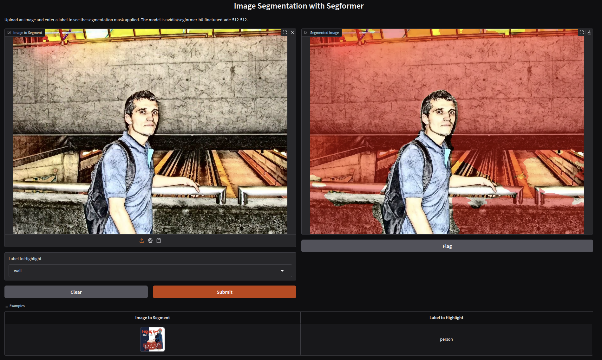

# Chapter 4. Using Hugging Face for Computer Vision Tasks

The computer vision models hosted on Hugging Face are grouped into the following tasks:

- Object Detection
- Image Classification
- Image Segmentation
- Video Classification
- Depth Estimation
- Image-to-Image
- Unconditional Image Generation
- Zero-Shot Image Classification

## Object Detection

> The primary goal of object detection is to not only classify the objects in the image
> or video but also to determine their precise positions by drawing bounding boxes around them.

## Image Segmentation

> Image segmentation is a technique that envolves separating an image into multiple segments,
> or regions. Each segment corresponds to a particular object of interest. Using image segmentation,
> you can analyze an image and extract valuable information from it.

Here are some of the use cases of this technique:

- Medical imaging - used to identify and segment tumors in MRI or CT scans
- Object detection and recognition
- Document processing - used to segment text regions in scanned documents
- Biometrics - used to identify and localize faces in images or video frames

Please explore [computer_vision_tasks.ipynb](computer_vision_tasks.ipynb) Jupyter Notebook for an example of
segmenting different objects (plane, person, wall) from an image using `nvidia/segformer-b0-finetuned-ade-512-512`
model ([link](https://huggingface.co/nvidia/segformer-b0-finetuned-ade-512-512)).

### Binding to Gradio

In the [image_segmentation.py example](image_segmentation.py) we are using [Gradio](https://www.gradio.app/) to both:

- spin a web server
- and a UX UI for us

This is how you can spin-up the mini-app:

```bash
uv run python chapter_04/image_segmentation.py
config.json: 6.88kB [00:00, 6.67MB/s]
model.safetensors: 100%|████████████████████████████████████████████████████████████| 15.0M/15.0M [00:00<00:00, 20.1MB/s]
preprocessor_config.json: 100%|█████████████████████████████████████████████████████████| 271/271 [00:00<00:00, 1.93MB/s]
Using a slow image processor as `use_fast` is unset and a slow processor was saved with this model. `use_fast=True` will be the default behavior in v4.52, even if the model was saved with a slow processor. This will result in minor differences in outputs. You'll still be able to use a slow processor with `use_fast=False`.
Device set to use cuda
* Running on local URL:  http://127.0.0.1:7860
* To create a public link, set `share=True` in `launch()`.
```

Then you may navigate to `localhost:7860` and test image segmentation in a nice looking UI. In the image below I showcased
how segformer model correctly highlighted a wall near Vendôme metro station in Montréal on my first day after immigrating
to Canada in 2011!


