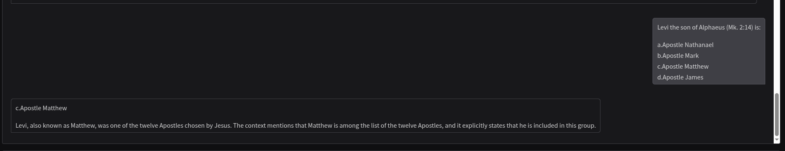
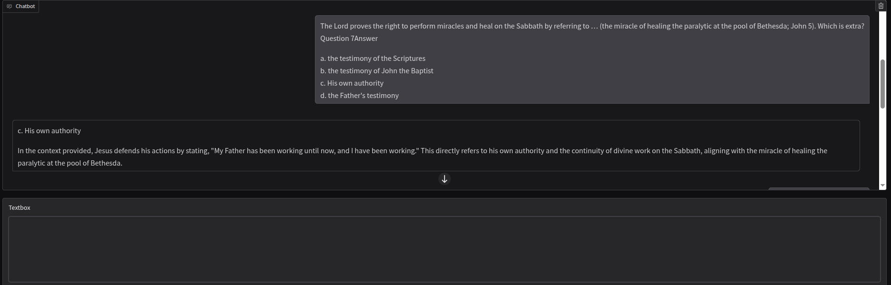

# Chapter 7. Creating LLM-based applications using LangChain and LlamaIndex

Main takeaways:

- Large Language Models (LLMs) are advanced NLP Models trained on massive
  datasets, capable of understanding and generating humanlike text
- LangChain simplifies building applications with LLMs by chaining components
  like prompts, models and memory
- LlamaIndex allows connecting LLMs with private data via retrieval-augmented
  generation (RAG) for more context-aware responses
- Techniques to maintain conversational context include prompt templates
  with history variables and classes like `RunnableWithMessageHistory`

LLMs contain billions of trainable parameters and processes text by breaking it
into tokens, often at the subword level, enabling understanding and generation
across languages and contexts.

## LangChain

LangChain is a framework designed to streamline creating applications that leverage LLMs.
It organizes component-prompt templates, the LLM actor, memory, and agent chains.

### Using `RunnableWithMessageHistory` class

For the sake of demonstration we will use this book's code example that highlights maintaining
a conversation with the LLM.

Note that the code significantly differs from the code given in the book due to breaking changes in
LangChain's and LangChain HF's libraries:

- `HuggingFaceEndpoint` takes model name, and not URL in its constructor
- `PromptTemplate` has moved packages to `langchain_core.prompts`
- `RunnableWithMessageHistory`'s `get_session_history` requires a callable that accepts `session_id: str`
  and returns `BaseChatMessageHistory` (use `InMemoryChatMessageHistory` from `langchain_core.chat_history`)
- HuggingFace's free serverless Inference API no longer supports `text_generation` endpoint for LLMs
  (deprecated as of 2025). Use `chat_completion` via `ChatHuggingFace`, third-party providers, or local
  inference instead
- For local inference, Ollama with `langchain-ollama` provides the simplest setup. Use `ChatOllama`
  with `ChatPromptTemplate` for conversation handling

Below is the sample output of a running program. Note, how on the second question, the model remembers
that we've asked about Musk the first time:

```bash
(hugging-face-ia)  vasile@vasilegorcinschi  ~/repos/hugging_face_ia   main ±  uv run python chapter_07/maintain_llm_conversation_with_langchain.py
Ask a question (type 'exit' to stop): Who is Elon Musk?
AI: Elon Musk is an entrepreneur and business magnate known for his roles in technology, automotive, space exploration, and sustainable energy industries. He was born on June 28, 1971, in Pretoria, South Africa.

Here are some key points about him:

1. Companies: He co-founded PayPal, SpaceX, Tesla, Inc., Neuralink, and The Boring Company.

2. Innovations:
   - Developed the first successful commercially sold all-electric car (Tesla Roadster)
   - Spearheaded the development of large-scale battery storage systems (Tesla Powerwall & Powerpack)
   - Pioneered reusable rockets with SpaceX
   - Working on advanced brain-machine interfaces at Neuralink

3. Wealth: As of 2023, Musk is one of the richest people in the world and has a net worth exceeding $200 billion.

4. Vision: Known for his ambitious goals, such as colonizing Mars through SpaceX and developing sustainable energy solutions with Tesla.

5. Controversies: He has faced criticism and legal challenges related to business practices, tweets, and public statements.

6. Awards: Has received numerous accolades including TIME Magazine's Person of the Year (2010).

Elon Musk is often described as a visionary leader who aims to solve some of humanity's most pressing problems through technological advancements.
Ask a question (type 'exit' to stop): What were some of his achievements in development of AI?
AI: While Elon Musk has been involved with artificial intelligence (AI) through various projects and companies, his primary contributions are more related to its application rather than the fundamental development of AI itself. Here are some key achievements and initiatives he has been associated with in the field of AI:

1. **Neuralink**:
   - **Mission**: Neuralink aims to develop brain-computer interfaces (BCIs) that could potentially help people with disabilities, treat neurological disorders, and ultimately merge human cognition with artificial intelligence.
   - **Significant Milestones**:
     - In 2019, they implanted devices in pigs and monkeys, showing the ability to record neural activity.
     - In 2020, Neuralink demonstrated a monkey playing Pong using its brain-controlled interface.
     - As of recent updates, they have been working on making these technologies more clinically viable.

2. **Tesla Autopilot**:
   - **Autonomous Driving**: Tesla's Autopilot system uses advanced AI and machine learning to enable semi-autonomous driving capabilities in vehicles.
   - **Continuous Updates**: Regular software updates improve the system's ability to recognize and respond to various driving scenarios, reducing accidents and increasing driver convenience.

3. **SpaceX's Starlink**:
   - **AI Applications**: While not directly an AI project, SpaceX’s Starlink satellite network uses AI for optimizing communication networks, predicting solar flares, and managing large-scale data processing.

4. **Advocacy and Ethical Considerations**:
   - **Ethics and Regulation**: Musk has been a vocal advocate for ethical considerations in AI development and regulation. He co-founded the nonprofit OpenAI to ensure that artificial general intelligence (AGI) benefits all of humanity.
   - **Public Awareness**: Through his public speaking engagements, tweets, and media appearances, he has raised awareness about the potential risks and benefits of AI.

5. **Founding Neuralink**:
   - **Neural Engineering**: Musk co-founded Neuralink in 2016 to develop brain-computer interfaces (BCIs). The goal is to create a neural link between human brains and computers, which could potentially treat neurological disorders, enhance human intelligence, and even merge humans with AI.

While Elon Musk's primary focus has been on the practical applications of AI rather than its foundational development, his involvement in companies like Neuralink and Tesla highlights his vision for integrating AI into various aspects of technology that can significantly impact society.
Ask a question (type 'exit' to stop): exit
AI: Sure, feel free to ask if you have any more questions or need further assistance!
```

## Connecting LLMs to your private data using LlamaIndex

LlamaIndex enables Retrieval-Augmented Generation (RAG), allowing LLMs to answer questions based on your private documents. The example demonstrates building a chatbot that can answer questions about a specific AsciiDoc file using a locally running Ollama model.

### Document-based Chatbot with Gradio Interface

The `chatbot_on_adoc_file.py` example showcases:

- **Document Loading**: Uses `DoclingReader` to parse AsciiDoc files
- **Vector Indexing**: Creates a searchable index using HuggingFace embeddings (`BAAI/bge-small-en-v1.5`)
- **Index Persistence**: Saves indices locally to avoid re-processing on subsequent runs
- **Local LLM Integration**: Connects to Ollama for querying (default: `qwen2.5:7b`)
- **Web UI**: Provides a Gradio chatbot interface for interactive Q&A

#### Key Features

1. **Automatic Index Caching**: The script generates a hash-based directory name to cache the vector index, speeding up subsequent runs.

2. **Configurable Temperature**: Control response randomness with the `-t/--temperature` flag (0 = most factual, 2 = most creative).

3. **Force Reindexing**: Use `--force-reload` to regenerate the index if the source document has changed.

#### Usage

```bash
uv run python chapter_07/chatbot_on_adoc_file.py -f ~/path/to/document.adoc
```

Optional arguments:
- `-t/--temperature`: Set LLM temperature (default: 0.1)
- `--force-reload`: Force re-indexing even if index exists

#### Sample Run

```bash
uv run python chapter_07/chatbot_on_adoc_file.py -f ~/repos/mpda/new_testament/06_social_service_of_the_savior_part_3.adoc
2025-12-14 13:11:55,646 - INFO - Load pretrained SentenceTransformer: BAAI/bge-small-en-v1.5
2025-12-14 13:11:56,941 - INFO - 1 prompt is loaded, with the key: query
Loading existing index from /home/vasile/repos/hugging_face_ia/chapter_07/.index_06_social_service_of_the_savior_part_3_8b1ceed1
Loading llama_index.core.storage.kvstore.simple_kvstore from /home/vasile/repos/hugging_face_ia/chapter_07/.index_06_social_service_of_the_savior_part_3_8b1ceed1/docstore.json.
Loading llama_index.core.storage.kvstore.simple_kvstore from /home/vasile/repos/hugging_face_ia/chapter_07/.index_06_social_service_of_the_savior_part_3_8b1ceed1/index_store.json.
2025-12-14 13:11:57,187 - INFO - Loading all indices.
2025-12-14 13:11:57,284 - INFO - HTTP Request: POST http://localhost:11434/api/show "HTTP/1.1 200 OK"
/home/vasile/repos/hugging_face_ia/chapter_07/chatbot_on_adoc_file.py:79: UserWarning: You have not specified a value for the `type` parameter. Defaulting to the 'tuples' format for chatbot messages, but this is deprecated and will be removed in a future version of Gradio. Please set type='messages' instead, which uses openai-style dictionaries with 'role' and 'content' keys.
  chatbot = gr.Chatbot()
* Running on local URL:  http://127.0.0.1:7860
```

The first run will create the vector index (takes a few seconds). Subsequent runs load the cached index instantly.

#### Example Interactions

The chatbot can answer questions based on the document content:





The examples demonstrate the chatbot's ability to understand context from the indexed document and provide accurate, detailed responses to user queries.
